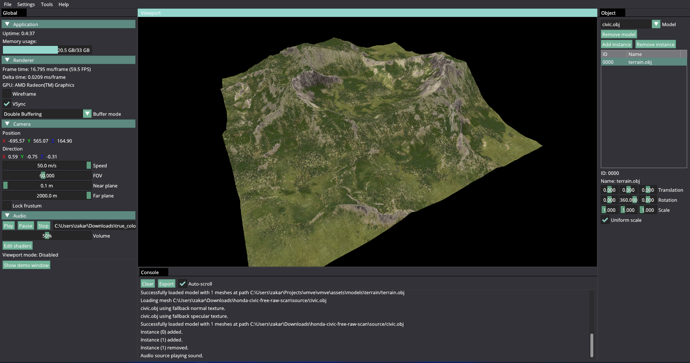

# VMVE (Vulkan Model Viewer and Exporter)
An application that provides an easy-to-use, efficient platform for 3D graphics
rendering and encryption for digital assets.



## Features
* Standalone application
* Vulkan rendering API
* Deferred Rendering
* Supports multiple models
* Texture mipmaps
* Debug rendering tools
* User Interface
* Internal logging


## Getting started
### Requirements
- [Vulkan SDK](https://www.lunarg.com/vulkan-sdk/)
- [Project external libraries](https://drive.google.com/file/d/1G0FTxthbHfspCL6YNE-fhNhXq9lVBB_k/view?usp=sharing)


### Building
```
git clone https://github.com/ZOulhadj/vmve.git
```

1. Update path to Vulkan SDK: Right-click the visual solution and click on the Properties option. Then head to 
```Configuration Properties > C/C++ > General > Additional Include Directories```. Ensure that the Vulkan include path points to the SDK you just installed.

2. Copy libraries to the correct locations: The ```vmve_external_libraries``` folder contains two folders called ```vmve``` and ```engine```. Each has its own respective
```vendor``` folder. This folder needs to be copied into each sub-project folder
```
- vmve
  |- vendor
- engine
  |- vendor
```


## Documentation
VMVE documentation is available [here](https://vmve-docs.rtfd.io)

## Downloads
All downloads can be found on the official [VMVE](https://zoulhadj.github.io/vmve_website/) website or in [releases](https://github.com/ZOulhadj/vmve/releases) section.
