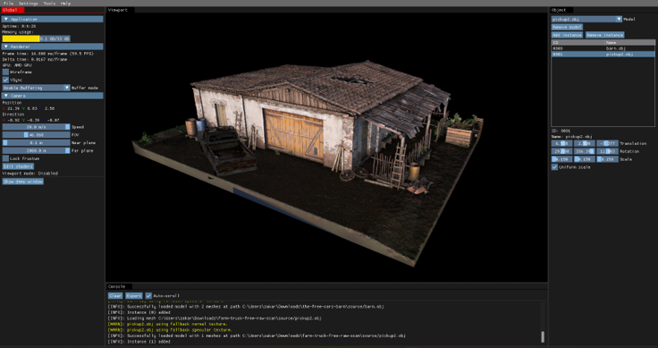

# VMVE (Vulkan Model Viewer and Exporter)
An application that provides an easy-to-use, efficient platform for 3D graphics
rendering and encryption for digital assets.


## Features
* Standalone application
* Vulkan rendering API
* Deferred Rendering
* Supports multiple models
* Texture mipmaps
* Debug rendering tools
* User Interface
* Internal logging

## Getting started
### Requirements
- [Vulkan SDK](https://www.lunarg.com/vulkan-sdk/)
- [Project external libraries](https://google.com)


### Building
```
git clone https://github.com/ZOulhadj/vmve.git
```

## Documentation
VMVE documentation is available [here](https://vmve-docs.rtfd.io)

## Downloads
All downloads can be found on the official [VMVE](https://zoulhadj.github.io/vmve_website/) website or in [releases](https://github.com/ZOulhadj/vmve/releases) section.




